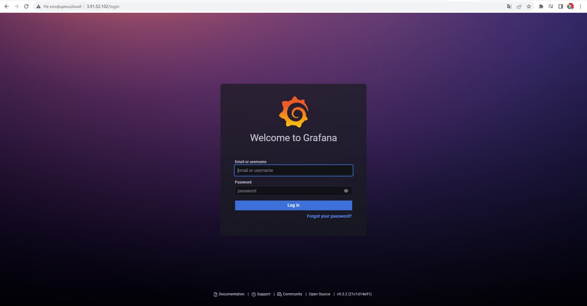
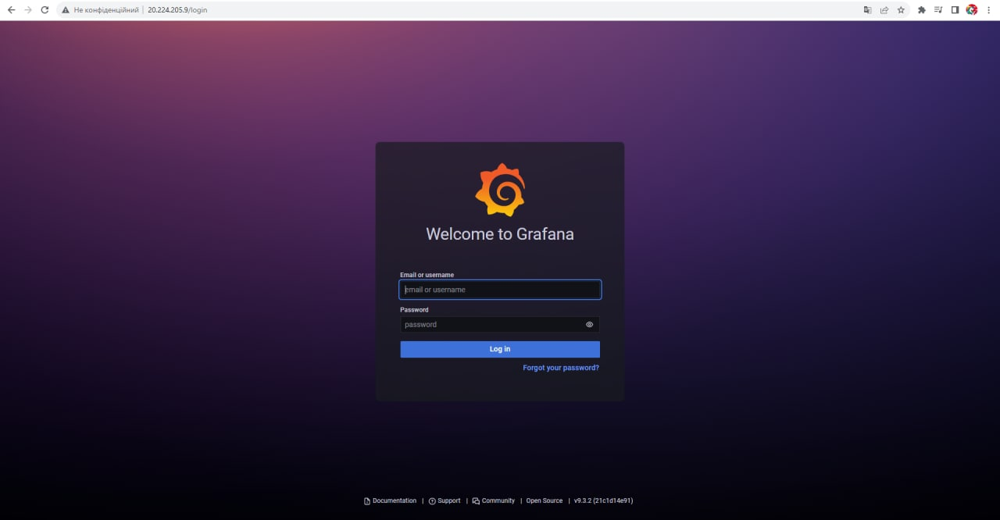

# Hometask6-Terraform

AWS_public_ip = http://3.91.52.102/login 

Azure_public_ip = http://20.224.205.9/login

 

**If You don't have Terraform installed, You should install it.**

If You have terraform and VScode (or another editor) installed, please follow these instructions:
* Download or git clone files from this repository;
* Open it in Your editor;
* Open terminal in Your editor;
* Set Your credentials in AWS and Azure accounts;
* 
