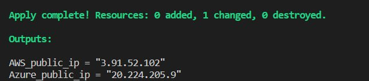

# Hometask6-Terraform

AWS_public_ip = http://3.91.52.102/login 

Azure_public_ip = http://20.224.205.9/login

 

**If You don't have Terraform installed, You should [install it.](https://developer.hashicorp.com/terraform/tutorials/aws-get-started/install-cli)**

If You have terraform and VScode (or another editor) installed, please follow these instructions:
* Download or git clone files from [this repository](https://github.com/victoriiastee/Hometask6-Terraform);
* Open it in Your editor;
* Set Your credentials for AWS and Azure accounts in [providers.tf file](https://github.com/victoriiastee/Hometask6-Terraform/blob/master/providers.tf); 

(In order to execute terraform script -
You need to configure AWS credentials. This is the short [video](https://www.youtube.com/watch?v=qmtDRmplMG4) about how You can do it.
You also need to create Azure application and Azure service principal. Via this [link](https://www.youtube.com/watch?v=Kf1Tai_BkWU&t=263s) - You can find the mini-guide with the instructions how to do that.)

* Generate Your ssh-key and set it in [id_rsa.pub file](https://github.com/victoriiastee/Hometask6-Terraform/blob/master/id_rsa.pub)
* Open terminal in Your editor. 

Run [main.tf](https://github.com/victoriiastee/Hometask6-Terraform/blob/master/main.tf) in Shell:
***=>>> terraform init***
***=>>> terraform plan***
***=>>> terraform apply***

#### Finally, You will see the outputs with public ip's of Your webservers:

### Thank You! (• ◡•)

